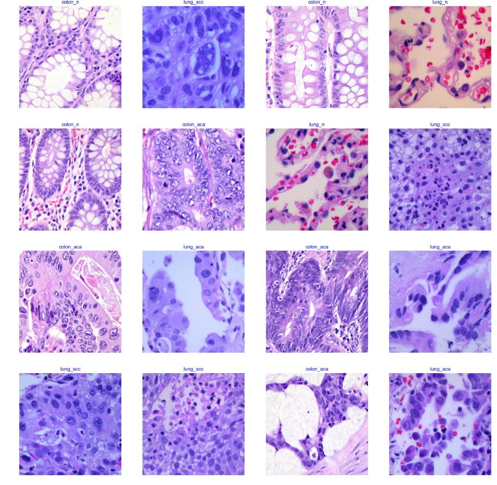
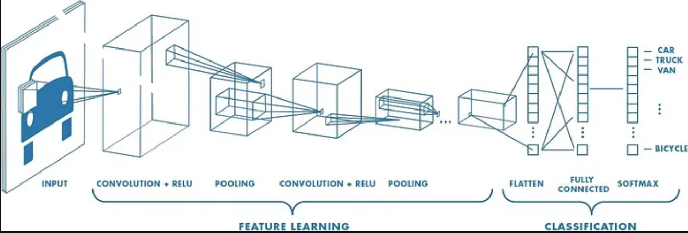

# Lung-and-Colon-Cancer-Classification

### About the Data

The dataset contains 25,000 histopathological images with 5 classes.
All images are 768 x 768 pixels in size and are in jpeg file format.

The 5 classes in the data, each with 5000 images are:
1. Lung benign tissue
2. Lung adenocarcinoma
3. Lung squamous cell carcinoma
4. Colon adenocarcinoma
5. Colon benign tissue

### About the project

The `notebook/training.ipynb` jupyter notebook contains the training and the image pre-processing code.
A Convolutional Neural Network is build 13 convolution layers with Max pooling.
A fully connected neural network with 2 Dense layers and ReLU as activation function.
The model is trained using 10 epochs with an early stopping criteria to avoid overfitting of the model.

The input data is split into 3 sets, namely: Train, Test and Validation.

The performance of the model is tested using Accuracy metric, which is turning out to be 95.3% on validation dataset.